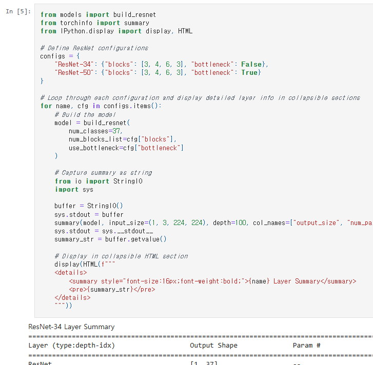
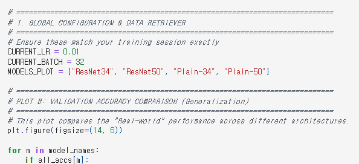
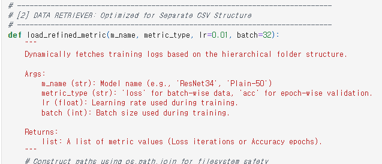
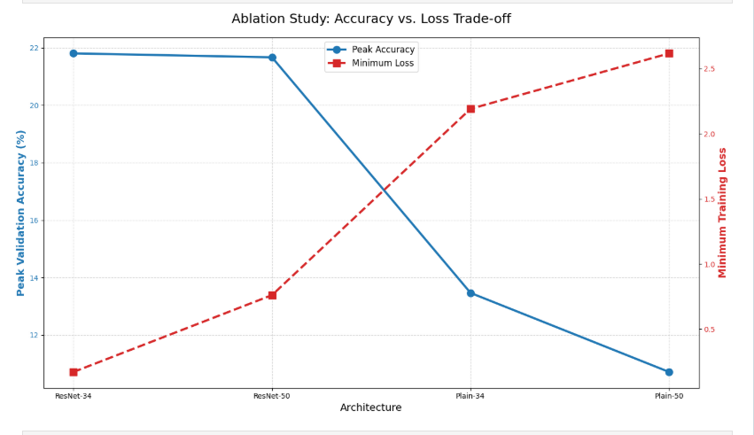
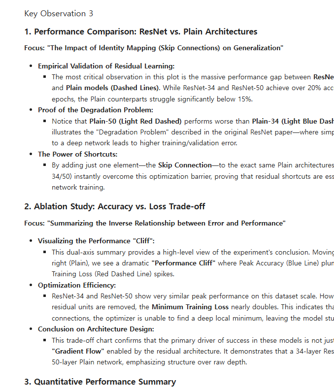
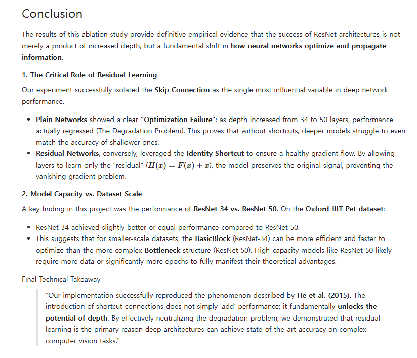
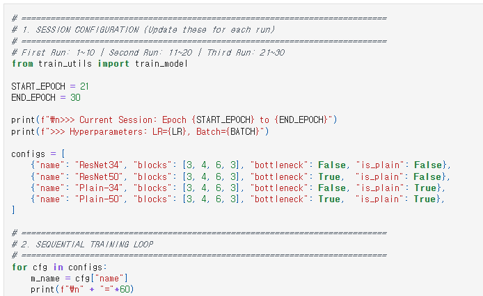

# AIFFEL Campus Online Code Peer Review Templete
- 코더 : 최에리나
- 리뷰어 : 최수정

# PRT(Peer Review Template)
- [x] **1. 주어진 문제를 해결하는 완성된 코드가 제출되었나요?**
    - 문제에서 요구하는 최종 결과물이 첨부되었는지 확인
        - 중요! 해당 조건을 만족하는 부분을 캡쳐해 근거로 첨부
        네 완성하셨습니다. 아래는 summary 구현 부분입니다.
        
    
- [x] **2. 전체 코드에서 가장 핵심적이거나 가장 복잡하고 이해하기 어려운 부분에 작성된 
주석 또는 doc string을 보고 해당 코드가 잘 이해되었나요?**
    - 해당 코드 블럭을 왜 핵심적이라고 생각하는지 확인
    - 해당 코드 블럭에 doc string/annotation이 달려 있는지 확인
    - 해당 코드의 기능, 존재 이유, 작동 원리 등을 기술했는지 확인
    - 주석을 보고 코드 이해가 잘 되었는지 확인
        - 중요! 잘 작성되었다고 생각되는 부분을 캡쳐해 근거로 첨부
        각 코드별로 해당하는 세션을 나눠서 주석을 잘 작성해주셨습니다.
        
        또한, LMS환경이 아니라 로컬에서 진행하셔서 데이터를 직접 다운받다보니, 그걸 저장하고 가져오는 함수를 쓰셨는데,
        아래와 같이 주석을 자세히 달아주셔서 좋았습니다.
        
        
        
- [x] **3. 에러가 난 부분을 디버깅하여 문제를 해결한 기록을 남겼거나
새로운 시도 또는 추가 실험을 수행해봤나요?**
    - 문제 원인 및 해결 과정을 잘 기록하였는지 확인
    - 프로젝트 평가 기준에 더해 추가적으로 수행한 나만의 시도, 
    실험이 기록되어 있는지 확인
        - 중요! 잘 작성되었다고 생각되는 부분을 캡쳐해 근거로 첨부
        문제 해결 전 개념에 대한 부분도 잘 정리하셨고, ablation study 부분에서 accuracy와 loss의 tradeoff를 시각화하신 부분도 인상 깊었습니다.
        문제 원인에 대해서도 잘 분석해주셨습니다.
        
        
        
- [x] **4. 회고를 잘 작성했나요?**
    - 주어진 문제를 해결하는 완성된 코드 내지 프로젝트 결과물에 대해
    배운점과 아쉬운점, 느낀점 등이 기록되어 있는지 확인
    - 전체 코드 실행 플로우를 그래프로 그려서 이해를 돕고 있는지 확인
        - 중요! 잘 작성되었다고 생각되는 부분을 캡쳐해 근거로 첨부
        중간중간에도 설명을 넣어주셨고 마지막에 결론으로 정리도 잘 해주셨습니다.
        
        
- [x] **5. 코드가 간결하고 효율적인가요?**
    - 파이썬 스타일 가이드 (PEP8) 를 준수하였는지 확인
    - 코드 중복을 최소화하고 범용적으로 사용할 수 있도록 함수화/모듈화했는지 확인
        - 중요! 잘 작성되었다고 생각되는 부분을 캡쳐해 근거로 첨부
        아래 사진처럼 각 부분을 나눠서 잘 작성해주셨고 2번항목에 첨부했던 것처럼 각 기능을 가진 함수도 나눠서 잘 사용해주셨습니다.
        

# 회고(참고 링크 및 코드 개선)

에리나님께서는 지금까지 배웠던 개념을 쭉 정리해주신 부분이 있어서 나중에 다시 이 프로젝트를 보더라도 관련 개념을 함께 다시 볼 수 있어 좋을 것 같다는 생각이 들었습니다.
그리고 데이터셋을 사용할 때에도 어떤 데이터셋인지 대한 설명을 따로 md로 정리해주신 점과 tradeoff로 시각화하신 부분이 인상 깊었습니다.